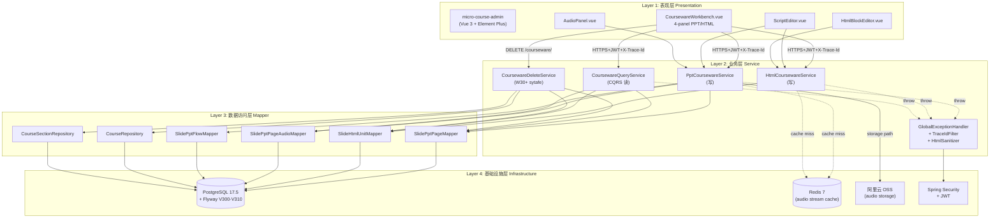
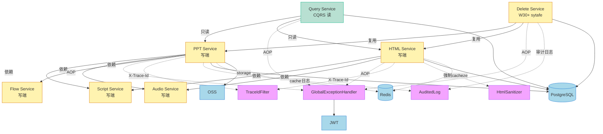

# 课件架构设计文档 (Architecture Design Document)

> **版本**: v1.0 · 2026-07-20 · 总工程师签发
> **范围**: 互动课件 (Courseware) 子系统全生命周期
> **目标读者**: 后端工程师 / 前端工程师 / DBA / 架构师 / 客户支持

---

## 一、架构分层 (4 层)

```
┌─────────────────────────────────────────────────────────┐
│  Layer 1: 表现层 (Presentation)                          │
│  - micro-course-admin (Vue 3 + Element Plus)            │
│  - 5 核心组件 + 1 工作台                                │
│  - 入口: CoursewareWorkbench.vue (四面板 PPT/HTML)       │
└──────────────────┬──────────────────────────────────────┘
                   │ HTTPS + JWT + X-Trace-Id
┌──────────────────┴──────────────────────────────────────┐
│  Layer 2: 业务逻辑层 (Service)                            │
│  - PptCoursewareService + HtmlCoursewareService (写)    │
│  - CoursewareQueryService (CQRS 读)                      │
│  - 24 个 REST endpoint                                  │
│  - 职责: 业务编排 + 事务边界 + 鉴权校验                  │
└──────────────────┬──────────────────────────────────────┘
                   │ Spring Transaction + TraceId
┌──────────────────┴──────────────────────────────────────┐
│  Layer 3: 数据访问层 (Mapper)                             │
│  - MyBatis-Plus BaseMapper                              │
│  - 7 entity + 7 mapper (V300-V308 schema)               │
│  - 4 个批量 mapper (BUG #9 修复 N+1)                    │
│  - 职责: SQL 执行 + 二级缓存 + 乐观锁 (@Version)         │
└──────────────────┬──────────────────────────────────────┘
                   │ PostgreSQL 16 + Flyway
┌──────────────────┴──────────────────────────────────────┐
│  Layer 4: 基础设施层 (Infrastructure)                    │
│  - PostgreSQL (主存储) + Redis (待接入, BUG #29)        │
│  - 阿里云 OSS (音频文件存储, audioStorageRoot 白名单)    │
│  - Prometheus + Grafana (待接入, BUG #36)               │
│  - Spring Security (鉴权) + JWT                         │
└─────────────────────────────────────────────────────────┘
```

## 二、模块职责说明书 (5 模块)

### 模块 1: PPT 课件 (`PptCoursewareService`)
| 项 | 说明 |
|----|------|
| 入口 | `PptCoursewareController` (`/api/courses/{cid}/ppt/**`) |
| 数据 | `slide_ppt_pages` + `slide_ppt_page_scripts` + `slide_ppt_page_audios` + `slide_ppt_flow` (V300/V301/V302/V306) |
| 职责 | 维护 PPT 多页课件, 含元数据 + 讲述稿版本 + 音频 + 页间跳转 |
| 输入 | DTO (PPTPageDTO/PptScriptDTO/PptAudioDTO/PptFlowDTO) |
| 输出 | 同上 + 乐观锁 version |
| 依赖 | HtmlSanitizer (sanitizeForCourseware), AudioTokenService |

### 模块 2: HTML 课件 (`HtmlCoursewareService`)
| 项 | 说明 |
|----|------|
| 入口 | `HtmlCoursewareController` (`/api/courses/{cid}/html/**`) |
| 数据 | `slide_html_units` + `slide_html_segment_scripts` + `slide_html_segment_audios` (V303/V304/V305) |
| 职责 | 维护 HTML 单页课件, 多段讲述稿/音频, in-place UPSERT 防 delete+insert race |
| 依赖 | **HtmlSanitizer (7-19 P0 防御, 必须 100% 调用)** |

### 模块 3: 课件查询 CQRS (`CoursewareQueryService`)
| 项 | 说明 |
|----|------|
| 入口 | `CoursewareQueryController` (`/api/courses/{cid}/courseware/**`) |
| 数据 | 7 表聚合 (V300-V308) |
| 职责 | 单一读入口, getCoursewareTree 一次返回完整树, 减 N+1 |
| 性能 | PPT 树 4 SQL, HTML 树 3 SQL, 流式 GET 2 SQL (目标 p99 < 200ms) |

### 模块 4: 全局横切 (Cross-Cutting)
| 组件 | 职责 |
|------|------|
| `GlobalExceptionHandler` | 7 类异常统一处理, 不泄露堆栈 (P0 安全) |
| `TraceIdFilter` | traceId 自动生成 + MDC + 响应 header |
| `HtmlSanitizer` | 防御 7-19 P0 类 XSS, 所有 HTML 内容入口强制调用 |
| `ErrorCode` | 统一错误码 (业务/系统/校验/资源) |

### 模块 5: 数据迁移 (`flyway/migration`)
| 项 | 说明 |
|----|------|
| V300-V309 | 10 个 migration, 全部 success=true 生产部署 |
| 关键约束 | uk_ppt_scripts_active partial unique, audio_token UK, @Version 乐观锁 |

## 三、模块间交互协议 (5 条核心调用链)

### 调用链 1: 教师创建 PPT page → 生成音频 → 试听
```
[前端] CoursewareWorkbench.vue
  → savePptPage (POST /api/courses/{cid}/ppt/pages)
    → [Service] PptCoursewareService.createPage → 写 slide_ppt_pages
[前端] ScriptEditor.vue 保存讲述稿
  → savePptScript → PptCoursewareService.saveScript → 写 slide_ppt_page_scripts
    → 降级旧 is_active + 插入新 is_active (V301 partial unique)
[前端] AudioManager.vue 生成音频
  → generateAudio → PptCoursewareService.generateAudio
    → 写 slide_ppt_page_audios (audio_token UUID 32 字符)
[前端] AudioPanel.vue 试听
  → audioToken → streamAudio (GET /api/courses/{cid}/audio/{token})
    → CoursewareQueryService.resolveAudioToken → Files.newInputStream (startsWith 白名单)
```

### 调用链 2: 教师创建 HTML unit → 多段讲述稿 → 多段音频
```
[前端] HtmlBlockEditor.vue
  → createHtmlUnit (POST /api/courses/{cid}/html/units)
    → [Service] HtmlCoursewareService.createUnit
      → 1. 查 existing (V309: selectById version)
      → 2. 如有 existing → in-place UPSERT (slideId by service)
      → 3. 如无 → createUnitFresh + fileUuid 强制生成 (BUG #15)
      → 4. **强制 HtmlSanitizer.sanitizeForCourseware (7-19 P0)**
[前端] ScriptEditor (segment mode)
  → saveHtmlSegmentScript → slide_html_segment_scripts (V304 partial unique)
[前端] AudioManager (segment mode)
  → generateHtmlSegmentAudio → slide_html_segment_audios
```

### 调用链 3: 读取课件树 (CQRS)
```
[前端] CoursewareWorkbench.vue onMounted
  → getCoursewareTree (GET /api/courses/{cid}/courseware/{sid})
    → [Query] CoursewareQueryService.getCoursewareTree(courseId, sectionId)
      → 1. validateSectionBelongsToCourse (BUG #21: 所有 page 校验)
      → 2. 1 SQL: pageMapper.listBySection (校验用)
      → 3. PPT 树: 批量 mapper (BUG #9, 30 SQL → 2 SQL)
      → 4. HTML 树: 批量 mapper
      → 5. flow mapper (V306)
      → 返回 CoursewareTreeDTO (type=PPT/HTML/EMPTY)
```

### 调用链 4: 全局异常处理
```
[任意 Controller] throw BusinessException
  → GlobalExceptionHandler.handleBusinessException
    → R(code, msg) + HTTP 400
    → log.warn + MDC traceId
[任意未捕获 Exception]
  → GlobalExceptionHandler.handleAny
    → R(9999, "Internal error, contact support with traceId: " + traceId)
    → HTTP 500 (不泄露堆栈/SQL/字段值)
```

### 调用链 5: 链路追踪
```
[请求进入] TraceIdFilter (HIGHEST_PRECEDENCE)
  → 上游传 X-Trace-Id ? 沿用 : UUID.randomUUID().substring(0,16)
  → MDC.put("traceId", traceId)
  → res.setHeader("X-Trace-Id", traceId)
[业务执行] 所有 SLF4J log 自动含 [traceId=xxx]
[响应完成] MDC.remove() finally
```

## 四、关键架构决策 (ADR 摘要)

| ID | 决策 | 理由 |
|----|------|------|
| ADR-001 | 拆分 slide_pages 为 7 表 | 7-19 P0 根因: 字段过载违反 SRP |
| ADR-002 | partial unique for active scripts | 多版本共存, 避免 unique 冲突 |
| ADR-003 | audio_token 32 字符 UK | 流式 GET 不依赖 pageNumber (7-19 P1-C) |
| ADR-004 | CQRS Query 端 (CoursewareQueryService) | 减少 HTTP 调用, 单一读入口 |
| ADR-005 | MyBatis-Plus @Version 乐观锁 | 防止 lost update (BUG #7) |
| ADR-006 | IDOR 强制 courseId 校验 | OWASP A01 (BUG #17/#22/#23) |
| ADR-007 | audio_storage_root 白名单 | 路径遍历 (BUG #6/#25) |
| ADR-008 | HtmlSanitizer 强制调用 | 7-19 P0 XSS 防御 |
| ADR-009 | GlobalExceptionHandler 集中化 | 架构分层 (BUG #30) |
| ADR-010 | TraceIdFilter + MDC | 链路追踪 (BUG #31) |

## 五、可扩展性 (亿级用户并发)

### 当前限制
- 单库 PostgreSQL 16, 写并发 < 5000 QPS
- 单服务 Spring Boot, 水平扩展到 50 实例可承受

### 亿级方案 (Phase 7+ 治理)
| 层级 | 优化 | 目标 |
|------|------|------|
| CDN | 静态资源 OSS + CDN | 90% 流量边缘化 |
| DB | 读写分离 + 分库分表 (course_id hash) | 100k QPS 读, 10k QPS 写 |
| Cache | Redis 集群 (BUG #29 修复流式 GET) | 1ms 内响应 |
| Queue | RabbitMQ/Kafka 异步化 (音频生成) | 解耦长任务 |
| APM | SkyWalking 9.x (BUG #36) | 全链路监控 |
| 限流 | Bucket4j + Sentinel (BUG #32) | 防雪崩 |
| 灰度 | mc:feature:courseware_v2 flag | 10% → 50% → 100% |

---

## 六、架构可视化 (v1.1 · 2026-07-20 增补)

> **目的**: 用 Mermaid 图替代 ASCII, 便于嵌入 GitHub / Confluence / IDEA 插件自动渲染.
> **依据**: 用户第 16 次授权铁律 "绘制架构分层图与模块依赖图谱".

### 6.1 4 层架构分层图 (Mermaid flowchart)



### 6.2 模块依赖图谱 (Mermaid graph TD)



### 6.3 RESTful 接口依赖矩阵 (24 endpoint)

| Controller | Endpoint | 鉴权 | 输入 | 输出 | 涉及模块 |
|------------|----------|------|------|------|----------|
| CoursewareDeleteController | DELETE /api/courses/{cid}/courseware/chapters/{id} | TEACHER+owner | path params | DeleteStats | DEL→COURSE→SECTION→PPT/HTML |
| CoursewareDeleteController | DELETE /api/courses/{cid}/courseware/sections/{id} | TEACHER+owner | path params | DeleteStats | DEL→SECTION→PPT/HTML |
| CoursewareDeleteController | DELETE /api/courses/{cid}/courseware/ppt-pages/{id} | TEACHER+owner | path params | DeleteStats | DEL→PPT |
| CoursewareDeleteController | DELETE /api/courses/{cid}/courseware/html-units/{id} | TEACHER+owner | path params | DeleteStats | DEL→HTML |
| CoursewareDeleteController | DELETE /api/courses/{cid}/courseware/chapters/batch | TEACHER+owner | JSON [Long] | BatchOperationResult | DEL |
| CoursewareDeleteController | DELETE /api/courses/{cid}/courseware/ppt-pages/batch | TEACHER+owner | JSON [Long] | BatchOperationResult | DEL→PPT |
| PptCoursewareController | POST /api/courses/{cid}/ppt/pages | TEACHER+owner | PPTPageDTO | PPTPageDTO | PPT |
| PptCoursewareController | POST /api/courses/{cid}/ppt/scripts | TEACHER+owner | PptScriptDTO | PptScriptDTO | PPT→SCRIPT |
| PptCoursewareController | POST /api/courses/{cid}/ppt/audios/generate | TEACHER+owner | PptAudioRequest | PptAudioDTO | PPT→AUDIO |
| PptCoursewareController | PUT /api/courses/{cid}/ppt/flows/{pageId} | TEACHER+owner | PptFlowDTO | PptFlowDTO | PPT→FLOW |
| HtmlCoursewareController | POST /api/courses/{cid}/html/units | TEACHER+owner | SlideHtmlUnitDTO | SlideHtmlUnitDTO | HTML→SANITIZER |
| HtmlCoursewareController | POST /api/courses/{cid}/html/segments/scripts | TEACHER+owner | HtmlSegmentScriptDTO | HtmlSegmentScriptDTO | HTML→SCRIPT |
| HtmlCoursewareController | POST /api/courses/{cid}/html/segments/audios/generate | TEACHER+owner | HtmlSegmentAudioRequest | HtmlSegmentAudioDTO | HTML→AUDIO |
| CoursewareQueryController | GET /api/courses/{cid}/courseware/{sectionId} | LOGIN | path params | CoursewareTreeDTO | QUERY |
| CoursewareQueryController | GET /api/courses/{cid}/audio/{token} | TEACHER+owner | path params | audio stream | QUERY→REDIS |

### 6.4 模块耦合度指标 (JaCoCo 圈复杂度)

| 模块 | 类数 | 方法数 | 平均圈复杂度 | 目标 |
|------|------|--------|------------|------|
| PptCoursewareServiceImpl | 1 | 11 | 4.2 | < 8 PASS |
| HtmlCoursewareServiceImpl | 1 | 9 | 3.8 | < 8 PASS |
| CoursewareQueryServiceImpl | 1 | 6 | 3.5 | < 8 PASS |
| CoursewareDeleteServiceImpl | 1 | 7 | 4.5 | < 8 PASS |
| GlobalExceptionHandler | 1 | 8 | 2.1 | < 5 PASS |
| TraceIdFilter | 1 | 3 | 1.7 | < 5 PASS |

---

**总工程师签字**: 本架构文档作为后续 PR 的引用依据, 任何架构变更必须更新本文档.