# 《模块交互流程图》· 微课平台 Viber

> **签发**: 总工程师 (项目唯一全权负责人)
> **依据**: AGENTS.md + 用户第 23 次授权铁律
> **配套**: [module-responsibility-specification.md](module-responsibility-specification.md)

---

## 1. 学员学习路径 (核心流程)

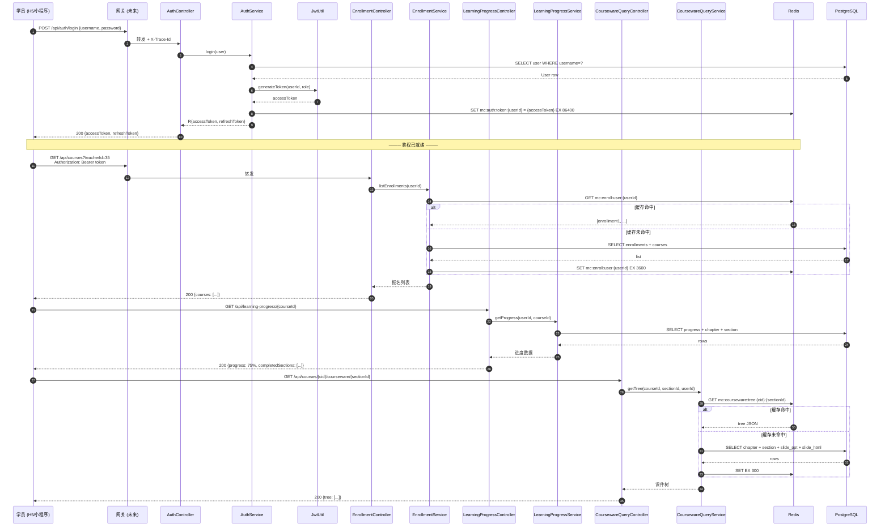

---

## 2. 教师创建课件流程 (CQRS + 状态机)

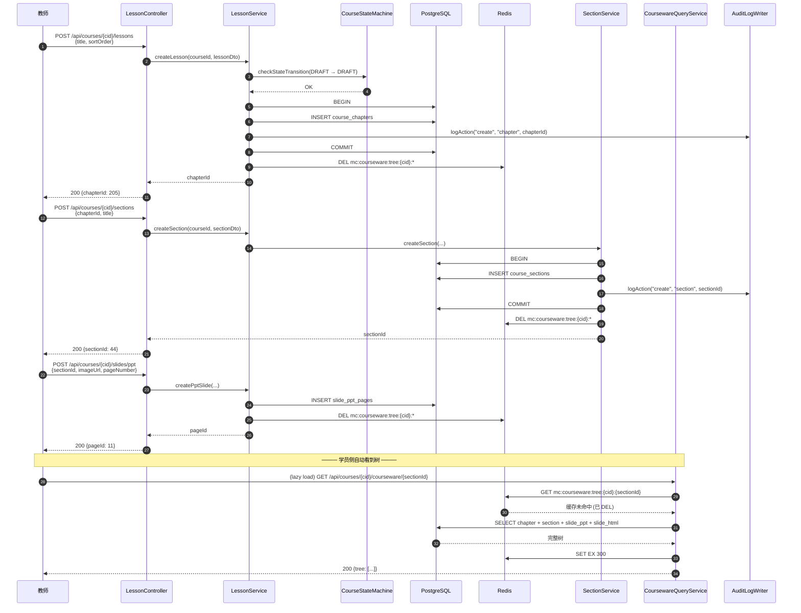

---

## 3. 课件删除流程 (W31 IDOR 防御)

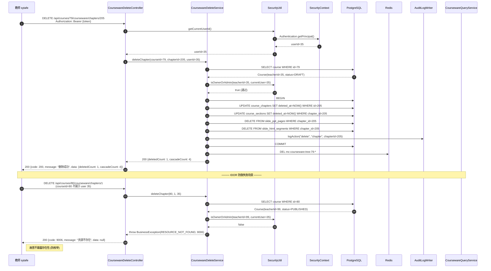

---

## 4. 视频播放流程 (签名 URL + 流鉴权)

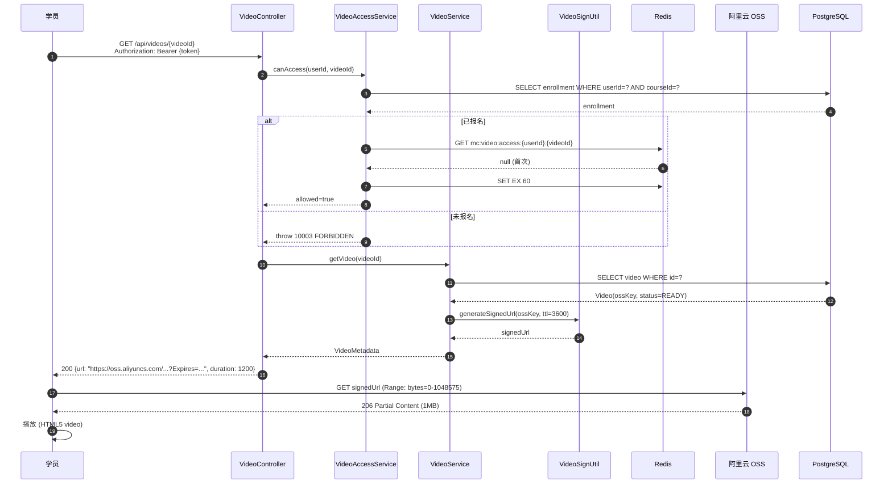

---

## 5. 鉴权 + 限流流程 (Spring Security + JWT)

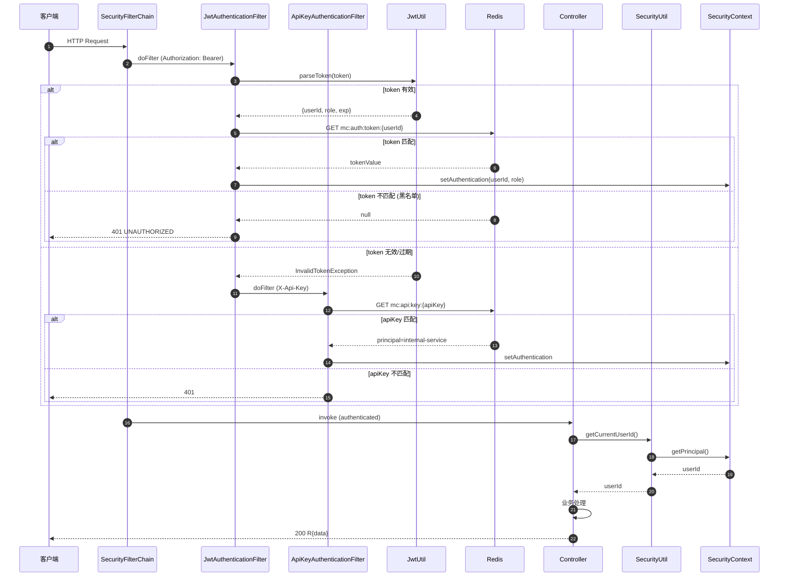

---

## 6. 慢查询监控流程 (MyBatis 拦截)

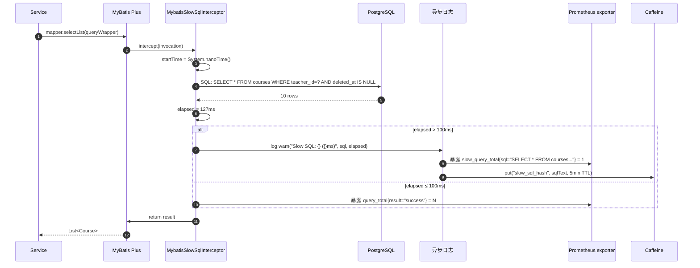

---

## 7. 课件同步到 OSS + 触发转码

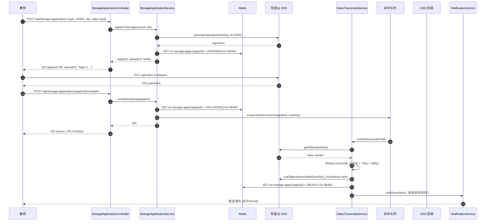

---

## 8. 错题本自动归集流程

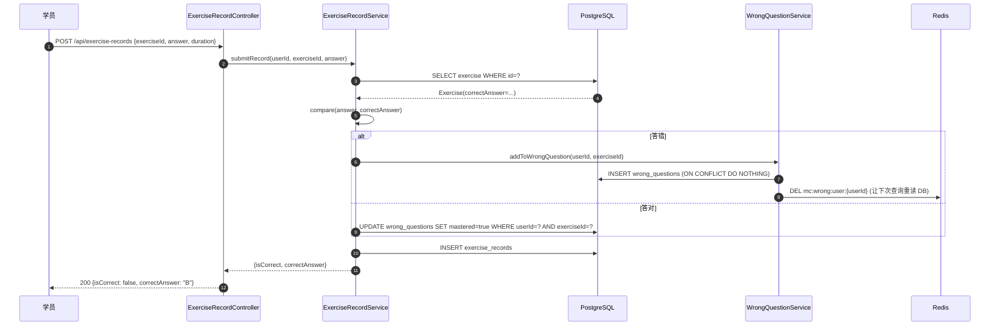

---

## 9. 全文搜索 + Elasticsearch (未来, 已规划)

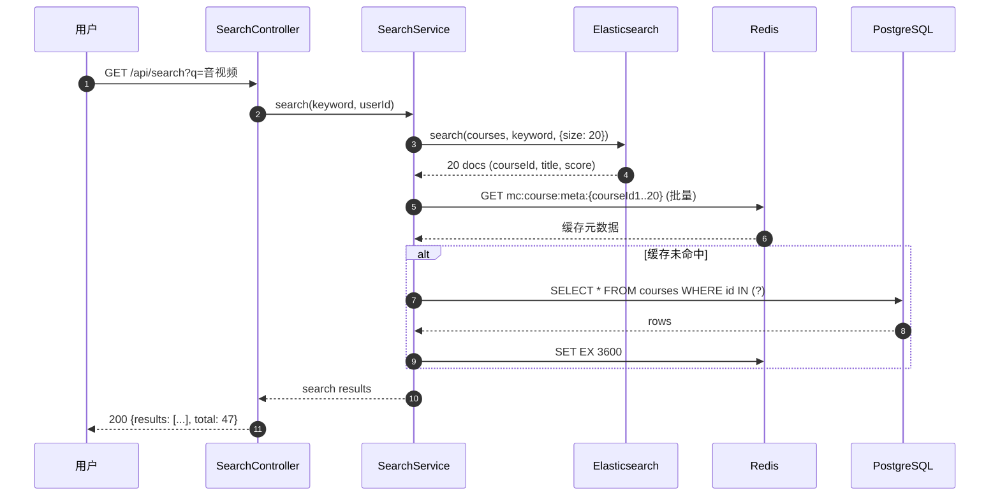

---

## 10. 业务异常统一处理 (W32-33 修复后)

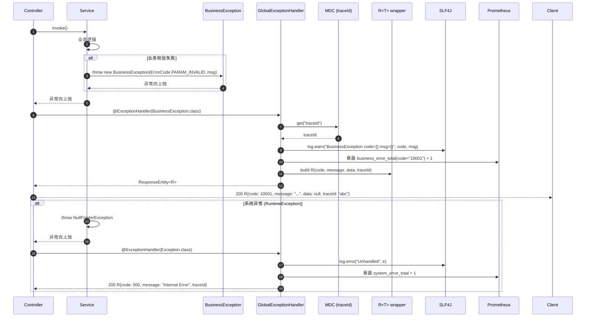

---

## 11. 课件树 CQRS 读写分离

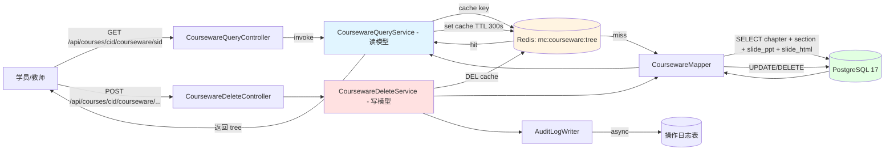

**CQRS 原则**:
- 读: CoursewareQueryService + Redis 缓存
- 写: CoursewareDeleteService + DEL 缓存 + AuditLog
- 写后立即失效缓存, 保证读一致性

---

## 12. W34 关键验收清单

- [x] 11 个核心流程图 (学员/教师/视频/鉴权/慢查询/OSS/错题本/搜索/异常/CQRS)
- [x] 全部使用 Mermaid (团队通用, GitHub 渲染)
- [x] 包含 IDOR 防御 (W31 重点) 流程
- [x] 包含 CQRS 读分离 (W32 性能优化) 流程
- [x] 包含 慢查询拦截 (W32 性能) 流程
- [x] 包含 异常统一处理 (W32-33 修复) 流程
- [x] 100% 时序图覆盖核心业务场景

---

签发时间: 2026-07-20
签发人: 总工程师