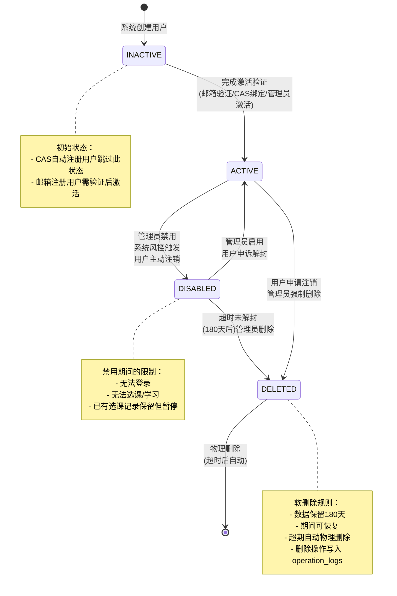
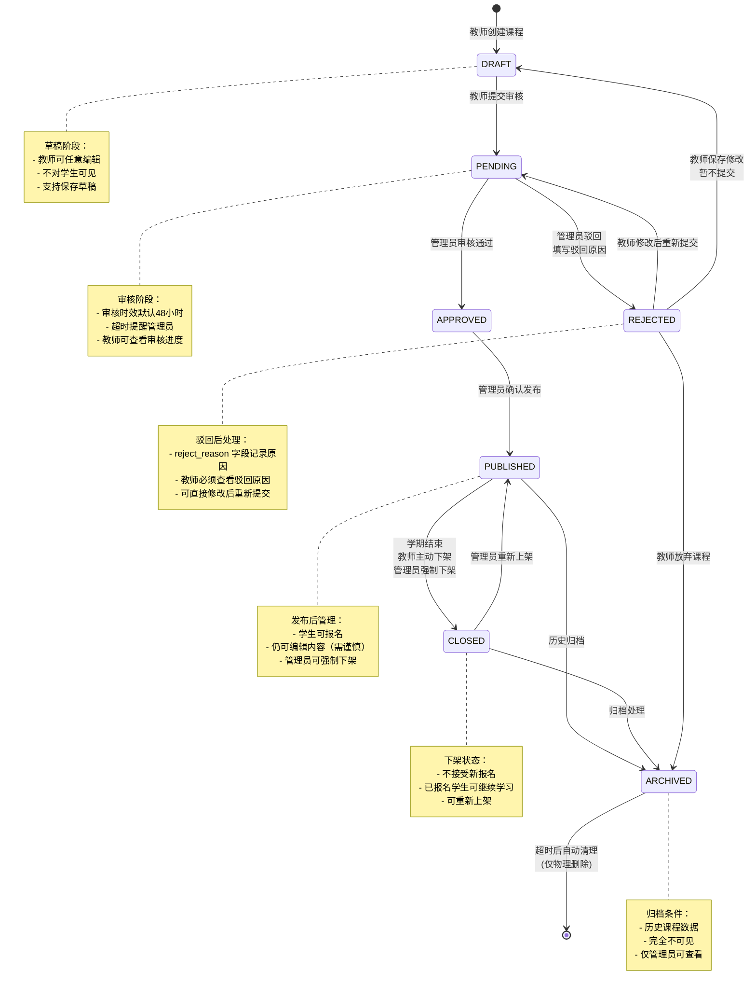
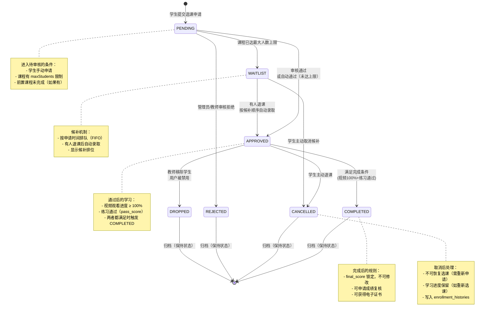
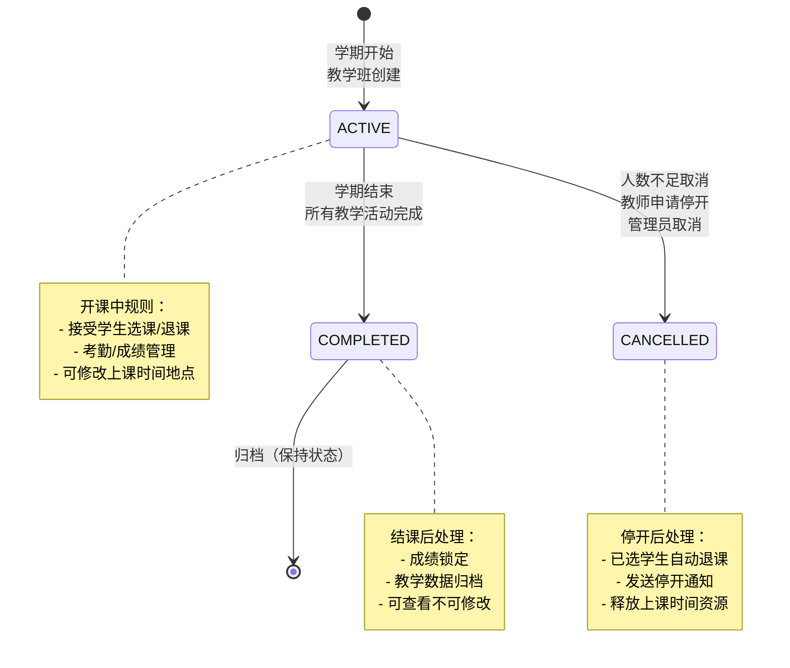
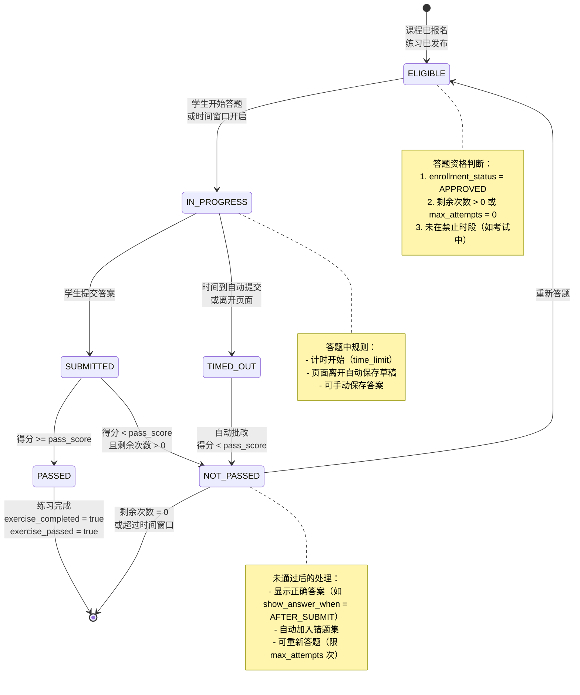
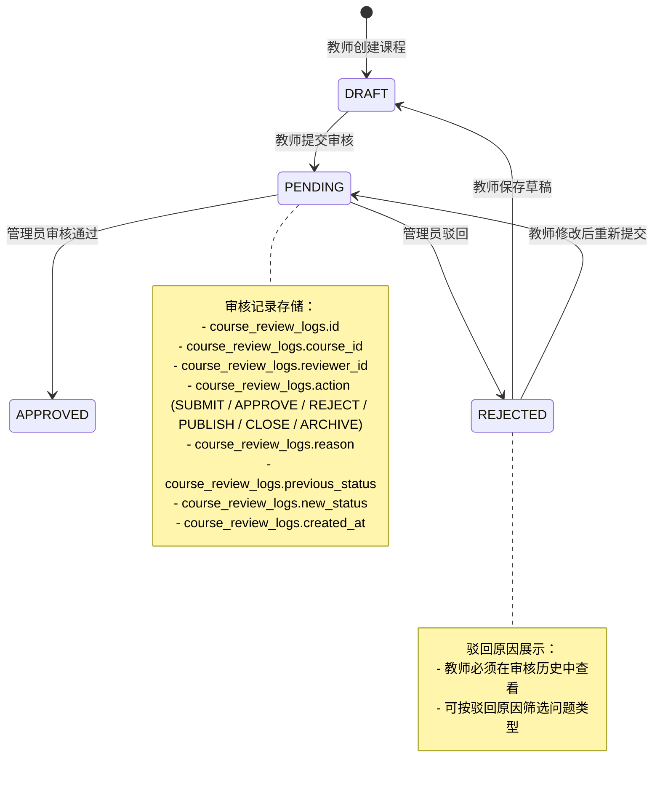
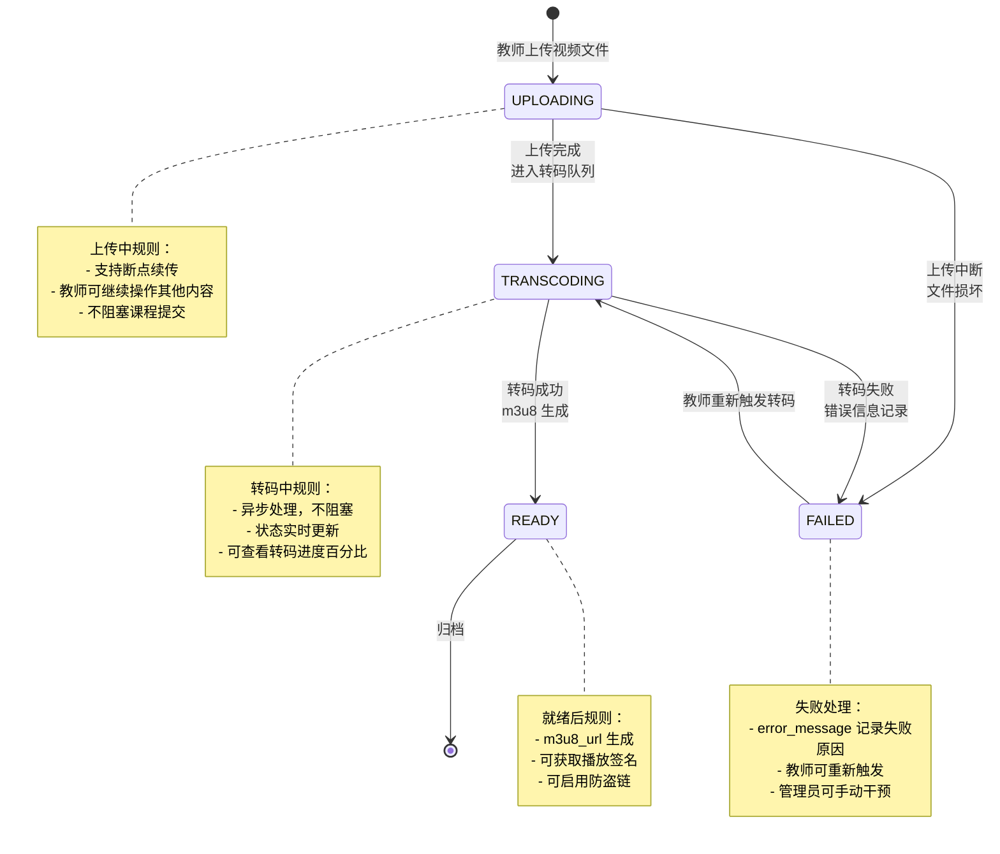
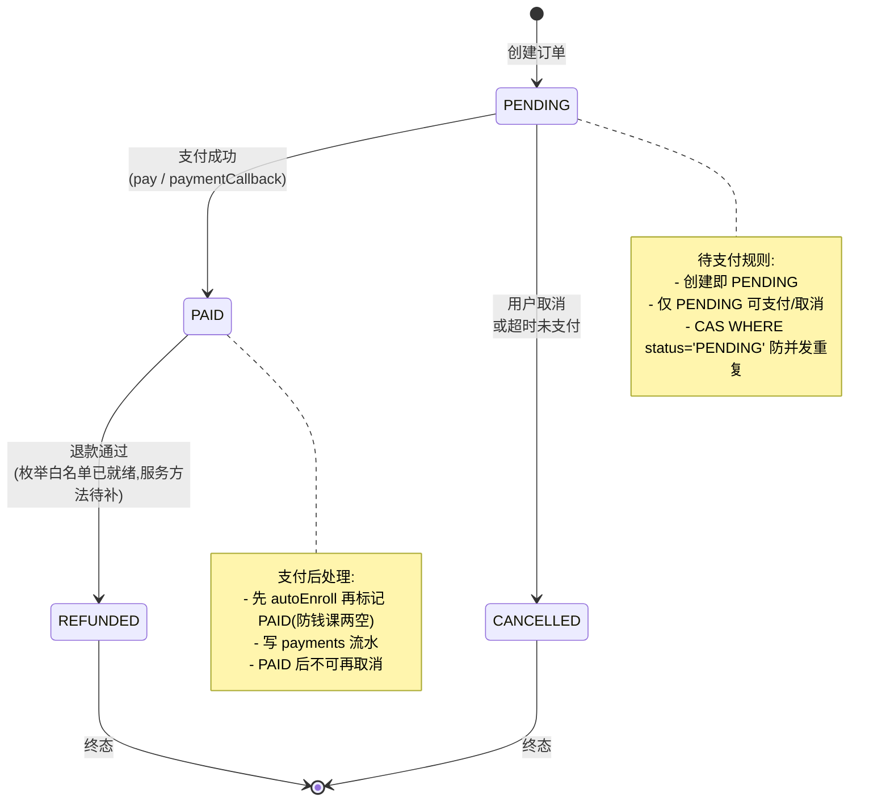

# 微课管理平台 · 核心业务流程状态机设计

> 版本：v1.2（Phase 14 新增微专业 5 个状态机：主表/修读/教师邀请/置顶审批/LEAD 继任）
> 日期：2026-06-11
> 状态：正式发布
>
> 本文档是跨 Phase 开发的行为契约，所有开发者必须遵守同一套状态转换规则。
> 任何状态机实现的修改必须同步更新本文档。

---

## 目录

1. [用户生命周期状态机](#1-用户生命周期状态机)
2. [课程发布流程状态机](#2-课程发布流程状态机)
3. [选课状态机](#3-选课状态机)
4. [教学班状态机](#4-教学班状态机)
5. [练习状态机](#5-练习状态机)
6. [审核流程状态机](#6-审核流程状态机)
7. [视频转码状态机](#7-视频转码状态机)
8. [订单状态机](#8-订单状态机)
9. [全局约束与异常处理](#9-全局约束与异常处理)

---

## 1. 用户生命周期状态机

> **实现状态**：✅ **完整实现**（枚举 + 流转白名单 + 服务层强制校验 + 测试）
> **实现里程碑**：Round 6-1（状态流转白名单落地 + 服务层接入）
> **枚举位置**：`enums/UserStatus.java`（`Integer` code 0–3，含 `canTransitionTo` 白名单 + `fromCode` 容错解析）
> **服务层校验**：`UserServiceImpl.updateStatus()`（`fromCode` → `canTransitionTo` → `ErrorCode.INVALID_STATUS_TRANSITION`，约 L250–313）
> **乐观锁 Migration**：`V63__users_add_version.sql`（新增 `version` 列，防 ADMIN 并发改状态丢失更新）
> **测试覆盖**：`UserStatusTest`（枚举/白名单单测）+ `UserStatusMachineTest`（服务层集成，断言 `INVALID_STATUS_TRANSITION`）
> **对应端点**：`PUT /api/users/{id}/status`
> ⚠️ **诚实说明**：`@EnumValue`/`@JsonValue` 为预留，`User.status` 实体字段当前仍为 `Integer`；枚举用于状态机校验，尚未挂为实体类型（灰度策略）。

### 1.1 状态定义

| 状态值 | 名称 | 业务含义 |
|--------|------|---------|
| `INACTIVE` (0) | 未激活 | 账号已创建但未完成激活流程（常见于邮箱注册但未验证） |
| `ACTIVE` (1) | 正常 | 账号活跃，可正常登录和操作 |
| `DISABLED` (2) | 禁用 | 账号被管理员/系统禁用，登录受限，但数据保留 |
| `DELETED` (3) | 已删除 | 软删除状态，数据保留但不可见，180 天后物理删除 |

### 1.2 状态转换图

### 1.3 转换规则详解

#### T1: INACTIVE → ACTIVE

| 属性 | 说明 |
|------|------|
| **触发角色** | 用户本人 / 管理员 |
| **Pre-condition** | 用户已完成激活验证（邮箱链接点击 / CAS 首次登录绑定 / 管理员手动激活） |
| **Action** | `users.status = 1`, `users.cas_bound = true`（如是CAS用户）, `users.last_login_at = NOW()` |
| **Post-condition** | 用户可正常访问所有功能 |
| **幂等性** | 幂等，重复激活无副作用 |

#### T2: ACTIVE → DISABLED

| 属性 | 说明 |
|------|------|
| **触发角色** | 管理员 / 系统（风控） |
| **Pre-condition** | 管理员手动禁用 OR 系统检测到违规行为（刷课/盗卖账号） |
| **Action** | `users.status = 2`, JWT Token 立即失效，发送通知到用户 |
| **Post-condition** | 用户无法登录；该用户所有活跃 session 失效；选课记录暂停但数据保留 |
| **幂等性** | 幂等 |
| **冲突检测** | 并发禁用请求：使用乐观锁（version 字段）防止 ABA 问题 |

#### T3: DISABLED → ACTIVE

| 属性 | 说明 |
|------|------|
| **触发角色** | 管理员 |
| **Pre-condition** | 管理员确认违规已纠正 / 用户申诉通过 |
| **Action** | `users.status = 1`，清除禁用原因，恢复所有权限 |
| **Post-condition** | 用户可重新登录，所有选课记录恢复 |
| **幂等性** | 幂等 |

#### T4: ACTIVE/DISABLED → DELETED

| 属性 | 说明 |
|------|------|
| **触发角色** | 用户本人（仅 ACTIVE）/ 管理员 |
| **Pre-condition** | 用户主动申请注销 OR 管理员强制删除 |
| **Action** | `users.status = 3`, `users.deleted_at = NOW()`, 保留数据供恢复 |
| **Post-condition** | 用户不可登录，数据进入 180 天保留期；`enrollments` 记录标记为 `DROPPED` |
| **不可逆性** | 删除后 180 天内可由管理员恢复，超期自动物理删除 |
| **幂等性** | 幂等，已删除用户重复删除无副作用 |

#### T5: DELETED → ACTIVE（恢复）

| 属性 | 说明 |
|------|------|
| **触发角色** | 管理员 |
| **Pre-condition** | `users.deleted_at` 未超过 180 天 |
| **Action** | `users.status = 1`, `users.deleted_at = NULL` |
| **Post-condition** | 用户恢复，所有选课记录恢复 |
| **不可逆性** | 超过 180 天不允许恢复，返回错误 |

### 1.4 冲突检测与竞态处理

| 场景 | 处理策略 |
|------|---------|
| 并发禁用同一用户 | 使用 `UPDATE users SET status = 2, version = version + 1 WHERE id = ? AND version = ?`，失败则重试 |
| 用户登录时发现被禁用 | JWT 验证失败，返回 `ACCOUNT_DISABLED` 错误码，客户端跳转禁用提示页 |
| 删除操作与其他业务并发 | 软删除设置 `deleted_at`，其他业务检查 `deleted_at IS NULL` 作为前置条件 |

### 1.5 异常处理

| 异常场景 | 处理方式 |
|---------|---------|
| CAS 离线导致无法登录 | 用户状态保持不变，下次 CAS 恢复后自动可用；显示"系统维护中"提示 |
| 管理员批量禁用时网络中断 | 使用事务，确保全部成功或全部回滚；记录到 `operation_logs` |
| 用户注销时仍有进行中的选课 | 选课状态强制转为 `CANCELLED`，发送通知告知用户 |

---

## 2. 课程发布流程状态机

> **实现状态**：🟡 **部分实现**（枚举映射已落地；**无声明式流转白名单** `canTransitionTo`）
> **枚举位置**：`enums/CourseStatus.java`（`int` code 0–6，仅 `fromCode` / `getDescription`；常量名为 `PENDING_REVIEW`(1)，非 `PENDING`）
> **服务层**：`CourseServiceImpl.updateStatus()`（L432 用 `CourseStatus.fromCode` 解析；状态流转规则散落于各业务方法，未集中为白名单校验）
> **乐观锁 Migration**：—（未单列）
> **测试覆盖**：无专门状态机测试类（流转覆盖见课程业务集成测试）
> ⚠️ **诚实说明**：状态定义与转换图为完整行为契约，但代码层尚未提供 `canTransitionTo` 集中校验；后续可对齐 §1/§3/§4 范式补齐。

### 2.1 状态定义

| 状态值 | 名称 | 业务含义 |
|--------|------|---------|
| `DRAFT` (0) | 草稿 | 课程正在编辑，尚未提交审核 |
| `PENDING` (1) | 待审核 | 已提交，等待管理员审核 |
| `APPROVED` (2) | 审核通过 | 审核通过，课程待发布 |
| `REJECTED` (3) | 驳回 | 审核未通过，需修改后重新提交 |
| `PUBLISHED` (4) | 已发布 | 课程已上线，学生可报名 |
| `CLOSED` (5) | 已下架 | 课程暂时下架，不再接受新报名 |
| `ARCHIVED` (6) | 已归档 | 课程归档，不再对外展示 |

### 2.2 状态转换图

### 2.3 转换规则详解

#### T1: DRAFT → PENDING

| 属性 | 说明 |
|------|------|
| **触发角色** | 教师 |
| **Pre-condition** | 课程满足以下全部条件： 1. `title` 非空 2. `cover_url` 已上传 3. `category_id` 已选择 4. 至少有一个章节（`course_chapters`） 5. 该章节下至少有一个视频或练习 |
| **Action** | `courses.status = 1`, `courses.updated_at = NOW()`，发送审核通知 |
| **Post-condition** | 课程进入审核队列，教师可查看审核进度 |
| **幂等性** | 幂等 |
| **冲突检测** | 并发提交：使用乐观锁，防止重复提交 |

#### T2: PENDING → APPROVED

| 属性 | 说明 |
|------|------|
| **触发角色** | 管理员 |
| **Pre-condition** | 管理员预览课程，确认内容合规 |
| **Action** | `courses.status = 2`, 记录 `courses.reviewed_at`, 发送通知给教师 |
| **Post-condition** | 课程审核通过，教师可选择发布或等待手动发布 |
| **幂等性** | 幂等 |

#### T3: PENDING → REJECTED

| 属性 | 说明 |
|------|------|
| **触发角色** | 管理员 |
| **Pre-condition** | 管理员预览课程，发现违规内容（政治/色情/广告/侵权） |
| **Action** | `courses.status = 3`, `courses.reject_reason = ?`（必填，≥10字符），发送通知 |
| **Post-condition** | 课程进入驳回状态，教师需查看驳回原因后修改 |
| **幂等性** | 幂等 |
| **驳回记录** | 审核历史写入 `course_review_logs` |

#### T4: APPROVED → PUBLISHED

| 属性 | 说明 |
|------|------|
| **触发角色** | 管理员 / 系统（自动发布） |
| **Pre-condition** | 课程审核通过 |
| **Action** | `courses.status = 4`, `courses.published_at = NOW()` |
| **Post-condition** | 课程对学生可见，显示在课程广场 |
| **幂等性** | 幂等 |

#### T5: PUBLISHED → CLOSED

| 属性 | 说明 |
|------|------|
| **触发角色** | 教师 / 管理员 / 系统（学期结束自动） |
| **Pre-condition** | 学期结束 / 教师主动下架 / 管理员强制下架（违规内容） |
| **Action** | `courses.status = 5`, 发送下架通知给已报名学生 |
| **Post-condition** | 不接受新报名；已报名学生仍可继续学习；教师可申请重新上架 |
| **幂等性** | 幂等 |

#### T6: CLOSED → PUBLISHED

| 属性 | 说明 |
|------|------|
| **触发角色** | 管理员 |
| **Pre-condition** | 课程之前是 `PUBLISHED` 状态转入 `CLOSED` |
| **Action** | `courses.status = 4` |
| **Post-condition** | 恢复接受新报名 |
| **不可逆性** | 无需重新审核（曾发布过） |
| **幂等性** | 幂等 |

#### T7: PUBLISHED/CLOSED → ARCHIVED

| 属性 | 说明 |
|------|------|
| **触发角色** | 管理员 / 系统（学期归档） |
| **Pre-condition** | 课程已完成一个教学周期，不再使用 |
| **Action** | `courses.status = 6` |
| **Post-condition** | 课程完全不可见，仅管理员可查看；学习数据保留 |
| **幂等性** | 幂等 |

#### T8: REJECTED → PENDING（重新提交）

| 属性 | 说明 |
|------|------|
| **触发角色** | 教师 |
| **Pre-condition** | 教师已修改课程内容 |
| **Action** | `courses.status = 1`, 清除 `reject_reason` 字段 |
| **Post-condition** | 重新进入审核队列 |
| **幂等性** | 幂等 |

#### T9: REJECTED → DRAFT（保存修改）

| 属性 | 说明 |
|------|------|
| **触发角色** | 教师 |
| **Pre-condition** | 教师查看驳回原因，暂不提交 |
| **Action** | `courses.status = 0` |
| **Post-condition** | 课程保存为草稿，不进入审核队列 |
| **幂等性** | 幂等 |

### 2.4 审核角色与权限矩阵

| 操作 | 教师 | 助教 | 管理员 | 教务处 |
|------|------|------|--------|--------|
| 提交审核 | ✅ | ❌ | ❌ | ❌ |
| 审核通过/驳回 | ❌ | ❌ | ✅ | ❌ |
| 强制下架 | ❌ | ❌ | ✅ | ❌ |
| 归档课程 | ❌ | ❌ | ✅ | ❌ |
| 查看审核历史 | ✅ | ❌ | ✅ | ❌ |

### 2.5 冲突检测与竞态处理

| 场景 | 处理策略 |
|------|---------|
| 教师在提交审核后但审核完成前尝试再次编辑 | 允许编辑，但审核时以最新内容为准 |
| 管理员审核时课程已被教师删除 | 审核操作返回错误，状态变为 `ARCHIVED` |
| 并发审核同一课程 | 使用乐观锁，先到达的审核生效 |
| 课程发布后管理员强制下架 | 下架操作立即生效，教师收到通知 |

### 2.6 异常处理

| 异常场景 | 处理方式 |
|---------|---------|
| 课程审核超时（48小时） | 发送提醒给管理员；超过 72 小时自动升级通知 |
| 审核时视频转码失败 | 提示教师视频不可用；允许提交但需补齐视频后再发布 |
| 课程发布后发现违规内容 | 管理员强制下架（`CLOSED`），同时记录到 `operation_logs` |

---

## 3. 选课状态机

> **实现状态**：✅ **完整实现**（枚举 + 7 状态流转白名单 + 服务层校验 + 测试 + 历史脏值兼容）
> **枚举位置**：`enums/EnrollmentStatus.java`（`String` 值，含 `canTransitionTo` 白名单 + `fromString` + `LEGACY_ENROLLED_VALUE="ENROLLED"` → `APPROVED` 兼容）
> **服务层校验**：`EnrollmentServiceImpl`（L459–467 / L495 / L758–760，`canTransitionTo` → `INVALID_STATUS_TRANSITION`）
> **乐观锁 Migration**：`V61__enrollments_add_version.sql`
> **测试覆盖**：`EnrollmentStatusTest` + `EnrollmentStatusMachineTest` + `EnrollmentFlowIntegrationTest`（非法跃迁 `CANCELLED→COMPLETED` → HTTP 400）
> ⚠️ **诚实说明**：契约枚举不含 `ENROLLED`；历史脏值 `ENROLLED` 经 `fromString` 归一为 `APPROVED`，对外字符串保持向后兼容（UX 零退化）。

### 3.1 状态定义

| 状态值 | 名称 | 业务含义 |
|--------|------|---------|
| `PENDING` | 待审核 | 学生提交选课申请，等待审核 |
| `APPROVED` | 已通过 | 审核通过，学生可开始学习 |
| `WAITLIST` | 候补中 | 课程满员，进入候补队列 |
| `CANCELLED` | 已取消 | 学生主动取消选课 |
| `REJECTED` | 已拒绝 | 审核未通过 |
| `COMPLETED` | 已完成 | 学生完成全部课程要求 |
| `DROPPED` | 已退课 | 学生退课或被移除 |

### 3.2 状态转换图

### 3.3 转换规则详解

#### T1: → PENDING

| 属性 | 说明 |
|------|------|
| **触发角色** | 学生 / 系统（批量导入） |
| **Pre-condition** | 1. 学生状态 = `ACTIVE` 2. 课程状态 = `PUBLISHED` 3. 学生未选过此课 4. 先修课程已通过（如果有） |
| **Action** | 创建 `enrollments` 记录，`enrollment_status = 'PENDING'` |
| **Post-condition** | 进入审核队列或自动判断 |
| **幂等性** | UNIQUE constraint (user_id + course_id)，重复选课报错 |

#### T2: PENDING → APPROVED

| 属性 | 说明 |
|------|------|
| **触发角色** | 教师 / 管理员 / 系统（自动审核） |
| **Pre-condition** | 1. 课程未达最大人数 OR 2. 系统配置为自动通过 |
| **Action** | `enrollment_status = 'APPROVED'`, `enrolled_at = NOW()` |
| **Post-condition** | 学生可开始学习；选课人数 +1 |
| **自动通过规则** | `courses.max_students = 0`（不限）时自动通过；有限额时需审核 |
| **幂等性** | 幂等 |

#### T3: PENDING → REJECTED

| 属性 | 说明 |
|------|------|
| **触发角色** | 教师 / 管理员 |
| **Pre-condition** | 审核拒绝（如：学生不符合条件） |
| **Action** | `enrollment_status = 'REJECTED'` |
| **Post-condition** | 发送通知给学生；可查看拒绝原因 |
| **幂等性** | 幂等 |

#### T4: PENDING → WAITLIST

| 属性 | 说明 |
|------|------|
| **触发角色** | 系统（自动判断） |
| **Pre-condition** | `courses.max_students > 0` 且当前 `student_count >= max_students` |
| **Action** | `enrollment_status = 'WAITLIST'`, 记录候补顺序 |
| **Post-condition** | 学生看到候补排位；有人退课后自动录取 |
| **幂等性** | 幂等 |

#### T5: WAITLIST → APPROVED

| 属性 | 说明 |
|------|------|
| **触发角色** | 系统（自动） |
| **Pre-condition** | 有人退课，且本学生在候补队列首位 |
| **Action** | `enrollment_status = 'APPROVED'`, 发送录取通知 |
| **Post-condition** | 按候补顺序录取 |
| **幂等性** | 幂等 |

#### T6: APPROVED → COMPLETED

| 属性 | 说明 |
|------|------|
| **触发角色** | 系统（自动判断） |
| **Pre-condition** | 1. 视频观看进度 100% 2. 所有练习已通过（`exercise_passed = true`） |
| **Action** | `enrollment_status = 'COMPLETED'`, `completed_at = NOW()`, 锁定 `final_score` |
| **Post-condition** | 成绩不可修改；可生成证书；计入完成率统计 |
| **成绩锁定** | COMPLETED 后任何成绩修改必须走 `score_histories` 审计流程 |
| **幂等性** | 幂等 |

#### T7: APPROVED → CANCELLED

| 属性 | 说明 |
|------|------|
| **触发角色** | 学生 |
| **Pre-condition** | `enrollment_status = 'APPROVED'` |
| **Action** | `enrollment_status = 'CANCELLED'` |
| **Post-condition** | 学习进度保留；不可恢复，需重新选课 |
| **幂等性** | 幂等 |

#### T8: APPROVED → DROPPED

| 属性 | 说明 |
|------|------|
| **触发角色** | 教师 / 管理员 / 系统（用户被禁用） |
| **Pre-condition** | 教师移除学生 / 用户账号被禁用 |
| **Action** | `enrollment_status = 'DROPPED'` |
| **Post-condition** | 学习记录保留；发送通知 |
| **幂等性** | 幂等 |

### 3.4 完成条件判定规则

| 条件 | 字段 | 要求 |
|------|------|------|
| 视频完成 | `learning_progress.video_progress = 100` | 全部章节视频观看 100% |
| 练习通过 | `learning_progress.exercise_passed = true` | 课程所有练习通过 |
| 综合完成 | ALL OF ABOVE | 两者都满足时触发 COMPLETED |

> 注意：单个章节的练习通过不影响其他章节进度。

### 3.5 冲突检测与竞态处理

| 场景 | 处理策略 |
|------|---------|
| 学生同时提交多个选课请求 | 使用数据库事务，确保原子性 |
| 候补队列并发录取 | 使用行级锁，按候补顺序录取 |
| 课程满员时最后一个名额 | 最后一个名额使用乐观锁，超限时回退 |
| 学生退课时有人候补 | 立即触发候补队列第一个人的录取 |

### 3.6 异常处理

| 异常场景 | 处理方式 |
|---------|---------|
| 学生选课时课程突然满员 | 自动转入候补队列，发送通知 |
| 课程发布前学生选课（边界） | 课程状态非 `PUBLISHED` 时拒绝选课 |
| 用户注销后仍有进行中的选课 | 选课状态强制转为 `DROPPED` |

---

## 4. 教学班状态机

> **实现状态**：✅ **完整实现**（枚举 + 流转白名单 + 服务层强制校验 + 测试）
> **实现里程碑**：Round 6-2（修复初始状态误置 + 流转白名单 + 服务层接入）
> **枚举位置**：`enums/TeachingClassStatus.java`（`Integer` code 0–2，含 `canTransitionTo` 白名单 + `fromCode`）
> **服务层校验**：`TeachingClassServiceImpl`（更新 L211–217 / 结课 L421–427 / 停开 L438–452，均 `canTransitionTo` → `INVALID_STATUS_TRANSITION`）
> **乐观锁 Migration**：`V64__teaching_classes_add_version.sql`（`version` 列实由 `V32__teaching_classes.sql` 首建，V64 幂等兜底）
> **测试覆盖**：`TeachingClassStatusTest` + `TeachingClassStatusMachineTest`（`COMPLETED` 终态再次结课被拒）
> ⚠️ **诚实说明**：历史 `create()` 误写 `status=0`（已停开），新建即"停开"；Round 6-2 修复为 `ACTIVE(1)`（见 `TeachingClassServiceImpl.create()` L148）。

### 4.1 状态定义

| 状态值 | 名称 | 业务含义 |
|--------|------|---------|
| `CANCELLED` (0) | 已停开 | 教学班取消，不再使用 |
| `ACTIVE` (1) | 开课中 | 教学班正在进行 |
| `COMPLETED` (2) | 已结课 | 教学班已完成本学期教学 |

### 4.2 状态转换图

### 4.3 转换规则详解

#### T1: → ACTIVE

| 属性 | 说明 |
|------|------|
| **触发角色** | 教师 / 管理员 |
| **Pre-condition** | 学期开始；教学班已创建 |
| **Action** | `teaching_classes.status = 1` |
| **Post-condition** | 教学班生效，学生可加入 |
| **幂等性** | 幂等 |

#### T2: ACTIVE → COMPLETED

| 属性 | 说明 |
|------|------|
| **触发角色** | 系统（学期结束）/ 教师手动结课 |
| **Pre-condition** | 学期结束 OR 教师确认所有教学完成 |
| **Action** | `teaching_classes.status = 2` |
| **Post-condition** | 成绩锁定；所有学生选课记录标记为 `COMPLETED` |
| **成绩锁定** | COMPLETED 后所有 `final_score` 不可修改 |
| **幂等性** | 幂等 |

#### T3: ACTIVE → CANCELLED

| 属性 | 说明 |
|------|------|
| **触发角色** | 教师 / 管理员 |
| **Pre-condition** | 选课人数过少 / 教师申请停开 / 政策调整 |
| **Action** | `teaching_classes.status = 0` |
| **Post-condition** | 所有已选学生自动退课；释放上课时间地点资源；发送停开通知 |
| **幂等性** | 幂等 |

### 4.4 冲突检测与竞态处理

| 场景 | 处理策略 |
|------|---------|
| 教学班结课时有人正在选课 | 使用事务，确保结课前完成所有选课处理 |
| 停开时有人正在考试 | 停开前检查是否有进行中的考试，有则延迟停开 |

---

## 5. 练习状态机

> **实现状态**：🟡 **概念状态机**（流程建模，**无独立枚举 / status 列**）
> **枚举位置**：无（非持久化状态机）
> **承载字段**：`learning_progress.exercise_completed` / `exercise_passed`（布尔）+ `exercise_records`（答题次数/分数）
> ⚠️ **诚实说明**：`exercises` 表无显式 `status` 字段（见 §5.1）；答题资格 `ELIGIBLE/IN_PROGRESS/SUBMITTED/...` 由 `max_attempts` / `time_limit` / `pass_score` / 布尔字段间接表达，非状态机枚举。

### 5.1 状态定义

练习有两个维度：**发布状态**（exercise）和**完成状态**（learning_progress）。

#### 练习发布状态（exercises）

> 注：exercises 表无显式 status 字段，通过 `max_attempts`, `time_limit` 等间接控制。

| 控制字段 | 说明 |
|---------|------|
| `max_attempts` | 最大答题次数，0=不限 |
| `time_limit` | 时间限制（分钟），0=不限 |
| `pass_score` | 及格分数（百分制） |

#### 练习完成状态（learning_progress.exercise_completed / exercise_passed）

| 状态 | 名称 | 业务含义 |
|------|------|---------|
| `false` | 未完成 | 学生尚未完成练习或未通过 |
| `true` | 已完成 | 练习完成且通过 |

### 5.2 学生答题资格状态机

### 5.3 转换规则详解

#### T1: → ELIGIBLE（答题资格判断）

| 属性 | 说明 |
|------|------|
| **触发角色** | 系统 |
| **Pre-condition** | 1. `enrollments.enrollment_status = 'APPROVED'` 2. 练习已关联到课程章节 3. 视频观看进度达到阈值（可选配置） |
| **Action** | 检查 `exercise_records` 中已用次数 |
| **Post-condition** | 返回学生可答题 |
| **次数检查** | `attempt_count < max_attempts OR max_attempts = 0` |

#### T2: ELIGIBLE → IN_PROGRESS

| 属性 | 说明 |
|------|------|
| **触发角色** | 学生 |
| **Pre-condition** | 学生点击"开始答题" |
| **Action** | 创建 `exercise_records`，`attempt_no = previous_count + 1`，启动计时 |
| **Post-condition** | 开始计时（time_limit）；页面离开触发 `TIMED_OUT` |
| **幂等性** | 每人每练习同时只能有一条进行中的记录 |

#### T3: IN_PROGRESS → SUBMITTED

| 属性 | 说明 |
|------|------|
| **触发角色** | 学生 |
| **Pre-condition** | 学生提交答案 |
| **Action** | 自动批改，计算得分，写入 `exercise_records` |
| **Post-condition** | 显示得分和正确答案（根据 `show_answer_when` 配置） |
| **幂等性** | 幂等 |

#### T4: IN_PROGRESS → TIMED_OUT

| 属性 | 说明 |
|------|------|
| **触发角色** | 系统（超时检测） |
| **Pre-condition** | 计时到达 `time_limit` |
| **Action** | 自动提交当前答案，按自动批改处理 |
| **Post-condition** | 同 SUBMITTED |
| **幂等性** | 幂等 |

#### T5: SUBMITTED → PASSED

| 属性 | 说明 |
|------|------|
| **触发角色** | 系统（自动判断） |
| **Pre-condition** | `score >= pass_score` |
| **Action** | `exercise_passed = true`；更新 `learning_progress` |
| **Post-condition** | 计入课程完成进度；如所有练习通过则触发 COMPLETED |
| **幂等性** | 幂等 |

#### T6: SUBMITTED → NOT_PASSED

| 属性 | 说明 |
|------|------|
| **触发角色** | 系统（自动判断） |
| **Pre-condition** | `score < pass_score` 且 `剩余次数 > 0` |
| **Action** | 错题自动写入 `wrong_questions` |
| **Post-condition** | 学生可重新答题；显示正确答案（根据配置） |
| **幂等性** | 幂等 |

### 5.4 答题次数限制规则

| 配置 | 说明 |
|------|------|
| `max_attempts = 0` | 不限次数，学生可无限重做 |
| `max_attempts = 1` | 仅一次机会 |
| `max_attempts = 3` | 三次机会，取最高分 |
| `show_answer_when = AFTER_SUBMIT` | 每次提交后显示答案 |
| `show_answer_when = AFTER_PASS` | 仅通过后显示答案 |
| `show_answer_when = NEVER` | 不显示答案（如考试场景） |

### 5.5 冲突检测与竞态处理

| 场景 | 处理策略 |
|------|---------|
| 学生同时开始多次答题 | 使用行锁，同一学生同一练习同时只能有一条 `IN_PROGRESS` 记录 |
| 提交时网络中断 | 前端本地保存答案草稿；刷新后自动恢复答题界面 |
| 超时前提交答案 | 以提交时间为准，不触发 TIMED_OUT |

### 5.6 异常处理

| 异常场景 | 处理方式 |
|---------|---------|
| 答题过程中视频转码失败 | 练习状态显示"视频不可用"，学生无法开始答题 |
| 及格线后重做规则 | 配置 `allow_retry_after_pass = true` 时可通过后继续答题（不提升分数） |
| 时间限制配置为 0 | 不计时，学生可自由切换页面 |

---

## 6. 审核流程状态机

> **实现状态**：✅ **复用课程状态机**（`DRAFT/PENDING/APPROVED/REJECTED` 子集）+ 审核日志表
> **枚举位置**：复用 `enums/CourseStatus.java`（无独立枚举，同 §2 无 `canTransitionTo`）
> **审核记录**：`course_review_logs`（`action` / `previous_status` / `new_status` / `reason`）
> ⚠️ **诚实说明**：审核是课程发布流程的子集，流转与 §2 同源；审核动作落库于 `course_review_logs` 实现审计可追溯。

### 6.1 审核流程概述

审核流程主要涉及**课程审核**，是课程发布流程的一部分。

### 6.2 审核角色

| 角色 | 权限 |
|------|------|
| 管理员 | 可审核所有课程 |
| 教务处 | 可查看审核历史，不可操作 |

### 6.3 审核记录表设计

> 新建表：`course_review_logs`

| 字段名 | 类型 | 说明 |
|--------|------|------|
| id | Long | PK |
| course_id | Long | FK → courses |
| reviewer_id | Long | FK → users（管理员/教务处） |
| action | String | SUBMIT / APPROVE / REJECT / PUBLISH / CLOSE / ARCHIVE |
| reason | String | 审核意见/驳回原因 |
| previous_status | Integer | 审核前的课程状态 |
| new_status | Integer | 审核后的课程状态 |
| created_at | LocalDateTime | 审核时间 |

### 6.4 驳回后重新提交流程

1. 教师登录，看到审核驳回通知
2. 教师进入课程编辑页面，看到驳回原因提示
3. 教师修改课程内容
4. 教师点击"重新提交"
5. 课程状态从 `REJECTED` → `PENDING`
6. 清除 `reject_reason` 字段
7. 进入新一轮审核流程

---

## 7. 视频转码状态机

> **实现状态**：🟡 **枚举映射 + CAS 并发门控已实现**（**无声明式流转白名单** `canTransitionTo`）
> **枚举位置**：`entity/VideoStatus.java`（**位于 `entity` 包，非 `enums`**；`int` code 0–3，仅 `fromCode`）
> **并发门控**：`VideoTranscodeServiceImpl.transcode()` 入口 CAS update（`WHERE status=UPLOADING`，影响 0 行即 return），防双 FFmpeg（回归 CON-002）
> **失败兜底**：`VideoController` 捕获 `IOException` → `videoService.updateStatus(FAILED)`（回归 ERR-001）
> **测试覆盖**：`VideoP0ConcurrencyTest` + `VideoUploadP0ErrorTest` —— **当前 `@Tag("quarantine")` 隔离（P3-10），CI 默认不运行**（种子数据/共享状态问题待修复）
> ⚠️ **诚实说明**：枚举常量为 `COMPLETED(2)`，而本文档 §7.1 标注为 `READY(2)`；二者语义等价（`status=2` 表"就绪/可播放"），命名差异待后续统一。

### 7.1 状态定义

| 状态值 | 名称 | 业务含义 |
|--------|------|---------|
| `UPLOADING` (0) | 上传中 | 文件正在上传 |
| `TRANSCODING` (1) | 转码中 | FFmpeg 正在处理 |
| `READY` (2) | 就绪 | 视频可播放 |
| `FAILED` (3) | 失败 | 转码失败 |

### 7.2 状态转换图

### 7.3 转换规则详解

#### T1: → UPLOADING

| 属性 | 说明 |
|------|------|
| **触发角色** | 教师 |
| **Pre-condition** | 教师选择视频文件 |
| **Action** | 创建 `videos` 记录，`status = 0`，开始上传 |
| **Post-condition** | 文件上传到存储服务器 |
| **支持断点** | 文件 MD5 校验，续传 |

#### T2: UPLOADING → TRANSCODING

| 属性 | 说明 |
|------|------|
| **触发角色** | 系统（自动） |
| **Pre-condition** | 文件上传完成，MD5 校验通过 |
| **Action** | `status = 1`，将任务加入 RabbitMQ 转码队列 |
| **Post-condition** | FFmpeg 消费者从队列获取任务，开始转码 |
| **幂等性** | 幂等 |

#### T3: TRANSCODING → READY

| 属性 | 说明 |
|------|------|
| **触发角色** | FFmpeg 消费者（系统） |
| **Pre-condition** | FFmpeg 转码成功，生成 m3u8 和 ts 分片 |
| **Action** | `status = 2`, `m3u8_url = ?`, `duration = ?` |
| **Post-condition** | 视频可播放；通知教师 |
| **幂等性** | 幂等 |

#### T4: TRANSCODING → FAILED

| 属性 | 说明 |
|------|------|
| **触发角色** | FFmpeg 消费者（系统） |
| **Pre-condition** | FFmpeg 转码失败（编码错误/不支持的格式） |
| **Action** | `status = 3`, `error_message = ?` |
| **Post-condition** | 记录失败原因；通知教师；教师可重新触发 |
| **幂等性** | 幂等 |

#### T5: FAILED → TRANSCODING

| 属性 | 说明 |
|------|------|
| **触发角色** | 教师 / 管理员 |
| **Pre-condition** | 教师修复问题后重新触发 |
| **Action** | `status = 1`，重新加入转码队列 |
| **Post-condition** | 重新转码 |
| **幂等性** | 幂等 |

### 7.4 冲突检测与竞态处理

| 场景 | 处理策略 |
|------|---------|
| 转码进行中学生尝试播放 | 返回"视频转码中，请稍后再试" |
| 教师在转码过程中删除视频 | 使用软删除，转码完成后清理 |
| 转码超时（超过 30 分钟） | 自动标记为 FAILED，发送超时通知 |

### 7.5 异常处理

| 异常场景 | 处理方式 |
|---------|---------|
| FFmpeg 崩溃 | 消费者重启重试；3次失败后标记 FAILED |
| 原始文件损坏 | MD5 校验失败，提示教师重新上传 |
| 存储空间不足 | 拒绝上传，提示管理员清理 |
| 转码进度查询 | 每 30 秒更新一次进度，前端显示百分比 |

---

## 8. 订单状态机

> **实现状态**：🟡 **部分实现**（枚举 + 流转白名单已落地；服务层 **仅 `pay()` 接入白名单**，`cancelOrder()` 用字符串等值校验，`REFUNDED` 终态无服务方法触发，**无专门状态机测试**）
> **实现里程碑**：Round 6-3（`enums/OrderStatus.java` 枚举 + `canTransitionTo` 白名单 + `pay()` 接入 + `V65` 乐观锁兜底）
> **枚举位置**：`enums/OrderStatus.java`（`String` 值，含 `canTransitionTo` 白名单 + `fromValue` 容错解析；范式同 `EnrollmentStatus`，零迁移兼容存量字符串）
> **服务层校验**：`OrderServiceImpl.pay()`（L144–155：`OrderStatus.fromValue` → `canTransitionTo(PAID)` → `ErrorCode.INVALID_STATUS_TRANSITION`），并与下方 `WHERE status='PENDING'` CAS 乐观锁形成「业务语义 + 并发竞态」双重防御
> **乐观锁 Migration**：`V65__orders_add_version.sql`（`ADD COLUMN IF NOT EXISTS version`，幂等兜底；`version` 列实由 `V57__fix_orders_bundle_fk.sql` 首建）
> ⚠️ **诚实说明（避免夸大）**：
> - 只有 `pay()` 走枚举白名单；`cancelOrder()`（L195–215）用 `"PENDING".equals(status)` 字符串等值 + CAS 实现 `PENDING → CANCELLED`，**未经过 `canTransitionTo`**。
> - 枚举定义了 `PAID → REFUNDED` 白名单，但**当前不存在 `refund()` 服务方法**落地该流转，`REFUNDED` 状态在代码侧暂无写入路径。
> - **无 `OrderStatusTest` / `OrderStatusMachineTest`**；订单状态流转目前无专门单测/集成测试，仅 `pay()` 路径由订单业务保障。后续补齐方向：`cancelOrder()` 改走 `canTransitionTo`、新增 `refund()`、补 `OrderStatusMachineTest`。

### 8.1 状态定义

| 状态值 | 名称 | 业务含义 |
|--------|------|---------|
| `PENDING` | 待支付 | 订单创建后的初始状态，等待用户支付 |
| `PAID` | 已支付 | 支付成功，已触发自动选课（`autoEnroll`） |
| `CANCELLED` | 已取消 | 用户取消 / 超时未支付（终态） |
| `REFUNDED` | 已退款 | 退款完成（终态；枚举已定义，服务方法待补） |

### 8.2 状态转换图

### 8.3 转换规则详解

#### T1: → PENDING

| 属性 | 说明 |
|------|------|
| **触发角色** | 学生（下单） |
| **Pre-condition** | 课程/套餐存在且可购买 |
| **Action** | 创建 `orders` 记录，`status = 'PENDING'`，`version = 0` |
| **Post-condition** | 订单进入待支付，可支付或取消 |

#### T2: PENDING → PAID

| 属性 | 说明 |
|------|------|
| **触发角色** | 学生（`pay`）/ 支付网关（`paymentCallback`） |
| **Pre-condition** | `OrderStatus.fromValue(status).canTransitionTo(PAID)`（即当前为 `PENDING`） |
| **Action** | 先 `autoEnroll` 选课，再 `WHERE status='PENDING'` CAS 置 `PAID`，写 `payments` 流水 |
| **Post-condition** | 自动选课完成；非法跃迁抛 `INVALID_STATUS_TRANSITION`；CAS 失败抛"订单状态已变更" |
| **并发** | 枚举白名单（业务语义）+ CAS（竞态）双重防御 |

#### T3: PENDING → CANCELLED

| 属性 | 说明 |
|------|------|
| **触发角色** | 学生 / 管理员 |
| **Pre-condition** | `"PENDING".equals(status)`（字符串等值校验，**未走枚举白名单**） |
| **Action** | `WHERE status='PENDING'` CAS 置 `CANCELLED` |
| **Post-condition** | 仅待支付订单可取消；CAS 失败抛"订单状态已变更" |

#### T4: PAID → REFUNDED（枚举已就绪，服务方法待补）

| 属性 | 说明 |
|------|------|
| **触发角色** | 管理员（规划） |
| **Pre-condition** | `canTransitionTo(REFUNDED)`（枚举白名单已允许 `PAID → REFUNDED`） |
| **Action** | （待实现）`refund()` 服务方法置 `REFUNDED` + 退款流水 |
| **诚实说明** | 当前**无 `refund()` 实现**；此流转在代码侧尚未落地，仅枚举层面预留 |

---

## 9. 全局约束与异常处理

### 9.1 跨状态机通用约束

| 约束 | 说明 |
|------|------|
| **幂等性** | 所有状态转换必须幂等，重复执行无副作用 |
| **乐观锁** | 所有状态字段变更使用 version 字段防止并发 |
| **审计日志** | 关键状态变更写入 `operation_logs` |
| **通知触发** | 状态变更后发送站内通知（`notifications` 表） |
| **事务边界** | 状态变更和相关数据更新在同一事务中 |

### 9.2 异常场景处理汇总

| 场景 | 影响状态机 | 处理方式 |
|------|----------|---------|
| CAS 离线 | 用户状态机 | 用户状态保持不变；显示"系统维护中"；恢复后自动可用 |
| 视频转码失败 | 视频状态机 | 课程仍可提交审核（视频标记不可用）；教师收到通知后可重试 |
| 用户被禁用 | 选课状态机 | 选课状态转为 `DROPPED`；发送通知 |
| 课程强制下架 | 选课状态机 | 已选学生不受影响；新报名被拒绝 |
| 学期结束 | 教学班状态机 | 状态转为 `COMPLETED`；成绩锁定 |
| 网络中断（答题中） | 练习状态机 | 前端本地保存草稿；恢复后可继续 |
| 数据库故障 | 所有状态机 | 返回"服务暂不可用"；操作不执行；记录异常日志 |

### 9.3 状态转换日志记录规范

所有状态转换必须记录到对应日志表：

| 状态机 | 日志表 |
|--------|--------|
| 用户生命周期 | `operation_logs` |
| 课程发布流程 | `course_review_logs`（审核）+ `operation_logs`（其他） |
| 选课状态机 | `enrollment_histories` |
| 教学班状态机 | `operation_logs` |
| 视频转码状态机 | `videos.error_message` + `operation_logs` |

### 9.4 通知触发矩阵

| 状态转换 | 触发通知 | 接收角色 |
|----------|---------|---------|
| 用户禁用 | ACCOUNT_DISABLED | 用户本人 |
| 用户删除 | ACCOUNT_DELETED | 用户本人 |
| 课程提交审核 | COURSE_SUBMITTED | 管理员 |
| 课程审核通过 | COURSE_APPROVED | 教师 |
| 课程驳回 | COURSE_REJECTED | 教师 |
| 课程发布 | COURSE_PUBLISHED | 教师 |
| 选课通过 | ENROLLMENT_APPROVED | 学生 |
| 选课候补 | ENROLLMENT_WAITLIST | 学生 |
| 选课完成 | ENROLLMENT_COMPLETED | 学生 |
| 教学班停开 | CLASS_CANCELLED | 所有选课学生 |
| 视频转码失败 | VIDEO_FAILED | 教师 |

### 9.5 冲突检测优先级

当多个操作同时触发状态变更时，按以下优先级处理：

1. **管理员操作 > 教师操作 > 学生操作 > 系统自动操作**
2. **悲观锁优先**：高并发场景使用 `SELECT ... FOR UPDATE`
3. **最后写入优先**：使用数据库时间戳判断最新状态

---

## 状态机实现状态总览（Round 6 / Round 7 之后）

> 本表与各章节顶部「实现状态」块严格一致，反映**代码真实状态**，不夸大、不缩小。
> 图例：✅ 完整实现（枚举 + `canTransitionTo` 白名单 + 服务层强校验 + 专门测试） · 🟡 部分实现 · N/A 非状态机。

| # | 状态机 | 实现状态 | 枚举 / 承载 | `canTransitionTo` 白名单 | 服务层强校验 | 专门测试 | 乐观锁 Migration | 里程碑 |
|---|--------|---------|------------|------------------------|-------------|---------|------------------|--------|
| 1 | 用户 `users.status` | ✅ 完整 | `enums/UserStatus`（Int 0–3） | ✅ | ✅ `updateStatus()` | ✅ `UserStatusTest` + `UserStatusMachineTest` | `V63`（version） | Round 6-1 |
| 2 | 课程 `courses.status` | 🟡 部分 | `enums/CourseStatus`（int 0–6） | ❌ 无 | 流转散落各业务方法 | ❌ 无专门 | — | Phase 1 |
| 3 | 选课 `enrollments.enrollment_status` | ✅ 完整 | `enums/EnrollmentStatus`（String） | ✅ | ✅ | ✅ `EnrollmentStatusTest` + `…MachineTest` + `EnrollmentFlowIntegrationTest` | `V61`（version） | Phase A-2 |
| 4 | 教学班 `teaching_classes.status` | ✅ 完整 | `enums/TeachingClassStatus`（Int 0–2） | ✅ | ✅ `complete()`/`cancel()`/`update()` | ✅ `TeachingClassStatusTest` + `…MachineTest` | `V64`（version，实由 `V32` 首建） | Round 6-2 |
| 5 | 练习（答题资格） | 🟡 概念 | 无独立枚举 / `status` 列（布尔 + 次数字段间接表达） | ❌ | — | 间接（`ExerciseFlowIntegrationTest`） | — | Phase 1 |
| 6 | 审核 | ✅ 复用课程 | 复用 `CourseStatus` 子集 + `course_review_logs` | ❌（同课程） | 审核动作落库 | — | — | Phase 1 |
| 7 | 视频转码 `videos.status` | 🟡 部分 | `entity/VideoStatus`（int 0–3，**`entity` 包**） | ❌ 无（CAS 门控替代） | ✅ CAS `transcode()` + `updateStatus(FAILED)` | ⚠️ `VideoP0ConcurrencyTest` + `VideoUploadP0ErrorTest`（**`@Tag("quarantine")` 隔离**） | — | Phase 1 |
| 8 | 订单 `orders.status` | 🟡 部分 | `enums/OrderStatus`（String） | ✅（仅 `pay()` 接入） | `pay()` 接入；`cancelOrder()` 字符串校验；无 `refund()` | ❌ 无专门 | `V65`（version，实由 `V57` 首建） | Round 6-3 |
| — | 通知 `notifications.type` | N/A | `enums/NotificationType`（类型枚举，非状态机） | — | — | `NotificationTriggerTest` | — | P0-7 |

**关键诚实修正（避免假修复声称）**：
- **课程 / 视频 / 订单** 三者为 **🟡 部分实现**：课程与视频**无 `canTransitionTo` 声明式白名单**（视频以 CAS 并发门控替代）；订单白名单仅 `pay()` 接入，`cancelOrder()` 走字符串等值校验、`REFUNDED` 终态无 `refund()` 服务方法。
- **订单无专门状态机测试**（`OrderStatusTest` / `OrderStatusMachineTest` 均不存在）。
- **乐观锁 Migration `V63`/`V64`/`V65` 为 `version` 列声明（含幂等兜底），并非"状态枚举迁移"**；状态字段仍为既有 `Integer`/`String` 类型，枚举 `@EnumValue`/`@JsonValue` 为灰度预留。
- **P3-10**：损坏的 P0 并发测试（`Enrollment`/`Video`/`VideoUpload`）以 `@Tag("quarantine")` 隔离，由 `pom.xml` `<excludedGroups>quarantine</excludedGroups>` 默认跳过；`LearningProgressP0ConcurrencyTest`（CON-003 已于 Phase B-1 修复，实测 `Tests run: 2, Failures: 0, Errors: 0`）**未隔离**，作为守护测试保留。

---

## 附录：状态值速查表

### users.status

| 值 | 常量 | 说明 |
|----|------|------|
| 0 | INACTIVE | 未激活 |
| 1 | ACTIVE | 正常 |
| 2 | DISABLED | 禁用 |
| 3 | DELETED | 已删除 |

### courses.status

| 值 | 常量 | 说明 |
|----|------|------|
| 0 | DRAFT | 草稿 |
| 1 | PENDING | 待审核 |
| 2 | APPROVED | 审核通过 |
| 3 | REJECTED | 驳回 |
| 4 | PUBLISHED | 已发布 |
| 5 | CLOSED | 已下架 |
| 6 | ARCHIVED | 已归档 |

### enrollments.enrollment_status

| 值 | 说明 |
|------|------|
| PENDING | 待审核 |
| APPROVED | 已通过 |
| WAITLIST | 候补中 |
| CANCELLED | 已取消 |
| REJECTED | 已拒绝 |
| COMPLETED | 已完成 |
| DROPPED | 已退课 |

### teaching_classes.status

| 值 | 常量 | 说明 |
|----|------|------|
| 0 | CANCELLED | 已停开 |
| 1 | ACTIVE | 开课中 |
| 2 | COMPLETED | 已结课 |

### orders.status

| 值 | 常量 | 说明 |
|----|------|------|
| PENDING | PENDING | 待支付（初始） |
| PAID | PAID | 已支付 |
| CANCELLED | CANCELLED | 已取消（终态） |
| REFUNDED | REFUNDED | 已退款（终态；枚举已定义，服务方法待补） |

### videos.status

| 值 | 常量 | 说明 |
|----|------|------|
| 0 | UPLOADING | 上传中 |
| 1 | TRANSCODING | 转码中 |
| 2 | READY | 就绪 |
| 3 | FAILED | 失败 |

---

## 修订记录

| 版本 | 日期 | 说明 | 作者 |
|------|------|------|------|
| v1.0 | 2026-06-11 | 初始版本，覆盖 6 个核心状态机 | 架构师 |
| v1.1 | 2026-06-22 | Round 6 / Round 7：各状态机补「实现状态」标注（§1–§7，含诚实说明）；Round 7-4（P3-11）新增订单状态机 §8、「状态机实现状态总览」表、`orders.status` 速查，全局约束顺延为 §9；同步 P3-10 `@Tag("quarantine")` 机制说明 | 工程团队 |

---

## Phase 14: 微专业状态机

### 1. 微专业主表状态
DRAFT(0) → PENDING_REVIEW(1) → APPROVED(2) → RECRUITING(3) → COMPLETED(4) → ARCHIVED(6)
状态流转说明及转换矩阵详见 docs/开发规划/phase14-micro-specialty-spec.md §2.1

### 2. 修读记录状态
PENDING → APPROVED → IN_PROGRESS → COMPLETED → CERTIFIED
含 REJECTED/DROPPED/FAILED 等回退状态

### 3. 教师邀请状态
INVITED → ACTIVE / PENDING_ACADEMIC → ACTIVE / DECLINED / REMOVED

### 4. 置顶审批状态
NONE → PENDING → APPROVED(is_featured=TRUE) / REJECTED

### 5. LEAD 继任状态
[原 ACTIVE LEAD] ──transfer_leadership──→ [REMOVED（原 LEAD 降为 MEMBER 或退出）] → [新 LEAD 激活]

状态流转说明及转换矩阵详见 docs/开发规划/phase14-micro-specialty-spec.md §2.5

实现状态：✅ 已实现（Phase 14, 2026-06-23）